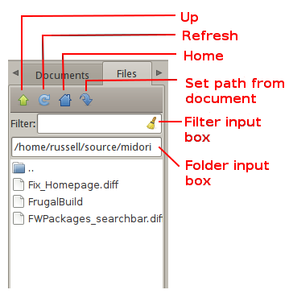

Geany Newsletter #1
-------------------

.. contents::

Editorial
=========

Welcome to the first Geany newsletter with highlights of the last few weeks
during Geany development and use. This newsletter is not intended to give a
complete overview of Geany news, but is trying to collect the most important
items. Have fun and happy coding!

Geany 0.20 has been released
============================

On January 2011, the 6th version 0.20 of Geany "Disra" was released. As always
the release contained a number of bug fixes as well as improvements and new
features.
Some of the highlights:

* Improve compatibility with GVfs using GIO to save documents (Alexey Antipov).
* Fix occasional crashes when closing a modified document and choosing
  "Save".
* Reorganize Find in Files dialog and add Files pattern to filter search
  results.
* Show mimetype icon in sidebar Documents list and notebook popup menu
  (Colomban Wendling).
* Add per-document indent width setting (Jiri Techet).
* Fix passing quoted arguments when using "Send Selection to". This
  means e.g. sed ’s/\./(dot)/g’ now works.
* Add alternative color scheme based on Python colors (View-Editor-Color
  Schemes - not all filetypes supported yet).
* Auto-indent after an HTML/XML line without a closing tag (Eugene Arshinov).
* Add Forth filetype (Thomas Huth).
* Add Lisp filetype (Mário Silva).
* Add Erlang filetype (Taylor Venable).
* Add translations: kk.
* Update translations: cs, de, en_GB, es, fi, fr, hu, ja, nl, pt, sl,
  sv, tr, zh_CN.

Geany-Plugins 0.20 have been released
=====================================

Shortly after the release of Geany the Geany-Plugins collection was released
with version 0.20. This collection includes a number of useful plugins, not
shipped with Geany itself. This release is the result of about 6 months of
development work and so it has quite a number of changes and some new plugins:

New plugins
^^^^^^^^^^^

UpdateChecker
*************

UpdateChecker implements a check for new releases of Geany and notifies the
user when one is available. It’s based on libsoup and can be configured to
check during startup or on request.

WebHelper
*********

WebHelper is a plugin that provides some web development facilities, such
as a web page preview and some debugging tools (web inspector). The plugin
implements the following features:

* A basic web view, allowing the display of any web page (using WebKit);
* Possible automatic reloading of the web view upon document saving;
* A web inspector/debugging tool for the web view’s content (including a
  JavaScript console, a viewer and editor of processed HTML and CSS, a
  network usage analysis tool and many more, thanks to WebKit).

Updates & Bugfixes
^^^^^^^^^^^^^^^^^^

Also there have been a lot of bugfixes and updates on plugins. For further
details please check the Release notes and/or the ChangeLog of plugins. A few
selected changes are:

GeanyExtraSel
*************

* Respect "Smart" home key (Geany does now).
* Fixed Scintilla Shift+movement key conversion of rectangle selection.
* Virtual spaces support.
* Per-file column mode.
* Added "Set Anchor", "Select to Anchor" and "Rectangle Select to Anchor".

GeanyGenDoc
***********

* Bump dependency on CTPL to 0.3.
* Add a popup menu for common actions in the documentation type selector.
* Fix indentation of inserted documentation blocs.
* Documentation type now defaults to Doxygen (rather than nothing).
* Add policy PASS to completely ignore a symbol.
* Add basic rules for PHP.
* Fix build against GTK+ 2.16.
* Don’t copy the system configuration file to the user’s one when hitting
  "Edit Current Language Configuration", only write it when saving changes.

GeanyLaTeX
**********

* Move LaTeX-menu to a separate menu inside Geany main menu.
* Add a feature to auto-capitalize letters on typing the beginning of a
  sentence.
* Add a way to put an icon for LaTeX-wizard into Geany’s main toolbar.
* Added a dialog for inserting BibTeX references based on available \*.bib- files.

TreeBrowser
***********

* Added bookmarks support.
* Added keybindings support.
* Added mime type icons in the tree.
* Many bugfixes and code improvements.

Geany-Development
=================

After the 0.20 release the development has slowed down a bit but nevertheless,
some changes did happen:

Update to Scintilla 2.22
^^^^^^^^^^^^^^^^^^^^^^^^

Right after the release of Geany 0.20 with Subversion r5521 an updated version
of Scintilla was been merged from the unstable branch into trunk. Geany trunk
is now running with version 2.22 of the Scintilla editing component.

Further patches
^^^^^^^^^^^^^^^

Support for COBOL
*****************

At the end of January 2011 a patch was committed to Geany trunk which enabled
COBOL support inside Geany. Now it’s possible to use features like syntax
highlighting for this language.

Plugins
=======

It was a quite active time right after the 0.20 release on the plugin
development side.

New plugins to Geany-Plugins-project
^^^^^^^^^^^^^^^^^^^^^^^^^^^^^^^^^^^^

Tableconvert
************

After a little chaos with naming, the new plugin Tableconvert was added to the
development version of the Geany-Plugins. It offers a way to convert tab
separated lists (e.g. imported from Microsoft Excel or LibreOffice Calc) into a
table. Currently the plugin supports HTML and LaTeX tables.

Debugger
********

The Debugger plugin has added a second binding for gdb to the Geany-Plugins
project.

GeanyPG
*******

With GeanyPG Hans Alves submitted a new plugin to geany-plugins project which
adds support for signing, encrypting and decryption of text files opened in
Geany.

Geany Universe
==============

New Mailing List – geany-newsletter-commits
^^^^^^^^^^^^^^^^^^^^^^^^^^^^^^^^^^^^^^^^^^^

When the geany-newsletter project was started, a new commit mailing was
created. The goal of this list is to notify all interested people whenever a
new commit has taken place inside the geany-newsletter git repository. As
always you can find the list via http://www.geany.org/Support/MailingList.

New team member – Colomban Wendling
^^^^^^^^^^^^^^^^^^^^^^^^^^^^^^^^^^^

In March 2011, Colomban Wendling joined the Geany core team. Over the last few
years he has submitted a lot of patches. He did a great job during the last
month - e.g. building up a tagmanager-in-memory patchset as well as providing a
big number of patches and providing support on both the mailing list as well as
IRC. Welcome Colomban!

Geany local
^^^^^^^^^^^

Geany at Chemnitzer Linuxtage 2011 (March 19th, 20th)
*****************************************************

On the coming weekend (around March 19th, 20th) there will be a local Linux and
FOSS convention in Chemnitz, Germany. Some of the Geany guys will be around and
have a little booth at the event. So if you are nearby, come join us for a
chat. You will find us next to the Xfce guys.
Details for this convention can be find on their homepage at
http://chemnitzer.linux-tage.de/2011/

Let us introduce you....
========================

This section is intended to introduce particular plugins or features on a
regular basis.

Plugin Focus
^^^^^^^^^^^^

File Browser
************

The File Browser plugins adds to the sidebar a tab with which you can browser
files and folders. By default it shows the contents of the folder containing
the first file opened in Geany. You can navigate to other drives and folders
using any of the options available at the very top of the tab:

* Up: Navigates to one folder higher in the file system.
* Home: Navigates to your Home folder.
* Set path from document: Sets the active folder to the one containing the
  current active document.
* Folder input box: Here you can enter any path you want to see in the File
  Browser. As you type the path it will offer autocompletion of the folder’s
  name.

Also at the top of the tab is the Filter input box in which you can enter a
file specification of those files you want to appear in the File Browser. The
file specifications must be quite simple - e.g. g\*.py or \*.xml. Regular
expressions are not supported. To clear the filter either click on the icon at
the right of the Filter input box or empty the Filter box and press [Enter].

Feature Focus
^^^^^^^^^^^^^

Comments formatting
*******************

When writing source code or in a markup language, it’s often necessary to mark
one or more lines as a comment. Geany offers several functions from the Edit
-> Format sub-menu which make this very easy:

* Comment Line(s)
* Uncomment Line(s)
* Toggle Line Commentation

To use these options on a single line, put the cursor on that line and select
the menu option. To use them on a block of code, select the whole block then
select the menu option. The Toggle Line Commentation menu option will, as its
name suggests, add comment markers to a normal line/section of code and, if the
line/section is already a comment, remove the comment markers. What’s great
about these options is that they insert or remove the comment markers
applicable to the type of file being edited. This means that you can focus on
the content of what you’re editing instead of having to worry about getting the
comment markers right. This is precisely Geany’s aim: to make coding easier and
faster without getting in your way.

Contact
=======

If you like to contribute to the newsletter, make a request or complaint about
content please contact frank@geany.org via email.
