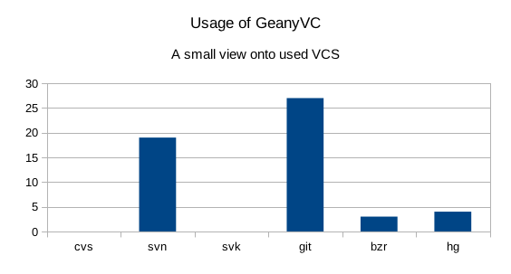
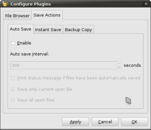
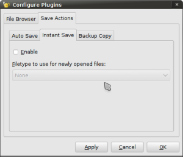
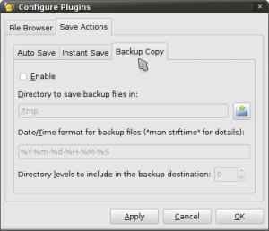
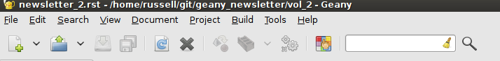
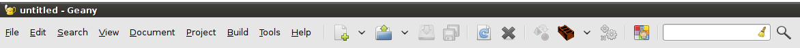

Geany Newsletter #2
-------------------

.. contents::

About Geany
===========

Geany is a small and lightweight Integrated Development Environment.
It was developed to provide a small and fast IDE, which has only a
few dependencies from other packages. Another goal was to be as
independent as possible from a special Desktop Environment like KDE
or GNOME - Geany only requires the GTK2 runtime libraries.

More information about Geany can be found at
`geany.org <http://www.geany.org/>`_.

Geany Development
=================

Update to Scintilla 2.25
^^^^^^^^^^^^^^^^^^^^^^^^

With svn r5682 another update to Scintilla has been done so
Geany's development version is now powered by Scintilla 2.25 in
favor of the version previously used: 2.22.

As with every update of Scintilla there have been a lot of
improvements. This includes changes to Scintilla itself, for
example: fixing an issue with marking of a word when double clicking
or fixing some memory leaks and unneeded redraws of editor window as
well on used lexer e.g. for SQL.

A detailed list of changes done with Scintilla can be found at
`Scintilla ChangeLog
<http://www.scintilla.org/ScintillaHistory.html>`_.

Real-time tag parsing
^^^^^^^^^^^^^^^^^^^^^

Parsing of symbols (also known as tags) in the file currently being
edited can now be done directly in memory. This change means that
tag parsing for the current document happens in real time when the content
changes; so the symbol list reflects the actual content of the
document rather than the state when it was last saved.

This can be configured (and disabled) in the preferences by the
`Symbol list update frequency` option under `Editor -> Completions`.

Automatic indentation width detection
^^^^^^^^^^^^^^^^^^^^^^^^^^^^^^^^^^^^^

Geany now has the ability to detect the indentation width used by a
file when opening it, making it easier to work with files which use
different indentation widths. The auto-detection, however, doesn't yet
work if the file uses a tabs-only indentation type.

To enable automatic detection of indentation width, open the Preferences
dialog and check `Detect width from file` in the `Editor->Indentation`
section.

Fixes to template encoding
^^^^^^^^^^^^^^^^^^^^^^^^^^

The encoding of template files is now properly auto-detected, fixing
loading of any template using an encoding incompatible with UTF-8.

Plugins
=======

New plugins
^^^^^^^^^^^

geanycfp
********

Back in January, William Fraser added with geanycfp a set functions
which are adding a couple of new functions to Geany's plugin pool
might be interesting to users.

After some time this plugin has been split up into
GeanyNumberedBookmarks and GeanyMacro, but this process is not yet
finished.

GeanyNumberedBookmarks
######################

The plugin adds an option to store bookmarks in files and
directly access them via a keybinding.

To set a numbered bookmark press Ctrl+Shift+(a number from 0 to 9).
You will see a marker appear next to the line number. If you press
Ctrl+Shift+(a number) on a line that already has that bookmark
number then it removes the bookmark, otherwise it will move the
bookmark there if it was set on a different line, or create it if it
had not already been set.

GeanyMacro
##########

Macros are well known from other tools. Users of Photoshop are
always saying how amazing the batch processing is for
manipulating images. However, this plugin adds something similar
to Geany with its macro feature: the plugin can record
small actions and rerun them after pressing e.g. a keybinding. This
could be very helpful if you e.g. need to remove the last two letters
of a line and search & replace or rectangle selection are not able
to solve the request.

Other features
##############

Remembering fold states:

By default, Geany does not remember the status of folding when
reloading a file e.g. on startup. This can be annoying if you have a
huge number of nested structures e.g. inside an XML-document. This
feature helps you to remember these states so you don't need to fold
up after loading.

Significant updates on Split Window Plugin
^^^^^^^^^^^^^^^^^^^^^^^^^^^^^^^^^^^^^^^^^^

There have been quite a few improvements and bug fixes done in the Split
Window plugin that ships with Geany which allows viewing two documents at the
same time.

Code folding is now supported in the split editor as of revision 5626.

Since revision 5633, the terminology used in the Split Window menu
under the Tools menu has been improved to avoid ambiguity regarding
the direction in which the split will take place.  Rather than using
the word Horizontal for when the editors are laid out horizontally
(the splitter is vertical), the words "Side by Side" are now used.
Likewise, when the editors are laid out vertically (the splitter is
horizontal), the words "Top and Bottom" are now used.

Previously, when the Split Window was active and the document
currently being viewed in it was closed in the main documents
notebook, the Split Window plugin would unsplit, even if there were
other documents which could be viewed instead.  As of revision 5634,
when this happens, the Split Window plugin will switch to view the
current document in the main documents notebook instead.  If there
are no more documents open, the Split Window plugin will unsplit.

Probably the most significant improvement to the Split Window plugin
is that it will now work on Microsoft Windows.  Previously, the
plugin was using trick to work around a bug in the Scintilla widget
Geany uses for its editor.  A side effect of this workaround was
that it caused serious issues in Windows and so the plugin was
disabled for the Windows build.  We fixed the bug in Scintilla and
sent the fix to the Scintilla project where it was merged upstream.
Geany is no longer required to use the previously mentioned trick,
and so the plugin will be re-enabled for the Windows build, with
equivalent functionality as it has on other platforms.

A view onto GeanyVC usage
^^^^^^^^^^^^^^^^^^^^^^^^^

GeanyVC is one of the oldest plugins of Geany and its adding
bindings for couple of popular version control systems to Geany as
for example svn or git. To get a feeling which bindings are getting
used to understand we started a little doodle poll a couple of weeks
ago. The output was interesting and a little surprising: Until End
of April 33 people took place on this poll and the 1st surprise did
happen. None of these are using GeanyVC for working with neither CVS
nor svk. In terms of CVS this has been a real surprise at it was one
of the most popular version control systems during the last decades.
SVK always took place a role inside 2nd row as its trying to add
some offline functionality to svn but keeping svn inside core. With
introducing git and adding a number of new features into Subversion
with version e.g. 1.6 the biggest advantages were also went away.

However, the most users do use the plugin for working with git
(~90%) followed by subversion as you can see from the tiny chart

Bazaar and Mercurial are also getting used, but only seeming to have
a minor role in GeanyVC's universe.

Let us introduce you...
=======================

This section is intended to introduce particular plugins or
features on a regular basis.

Plugin Focus
^^^^^^^^^^^^

Save Actions
************

The Save Actions plugin adds options available to you when saving files,
including: Auto Save, Instant Save and Backup Copy. Each of the options
can be enabled interdependently of the others but they can be even more
powerful when used in combination. Read on, discover their functions, and
judge for yourself if this plugin might make your use of Geany easier and
more productive.

Auto Save
#########

Auto Save provides an option to automatically save either the current
file or all open files at a defined interval. It can be very useful if you
tend to forget to save because it works in the background. The default
interval is 300 seconds, which is 5 minutes, but you might prefer to set
a longer or shorter interval.

Instant Save
############

Instant Save aims to make it easier to make use of Geany's file-specific
features with newly-created files. With this plugin activated you can
specify what file type new files are to be treated as. If you often work
with Python for example, and are testing code snippets, you can activate
the plugin, configure new files to be treated as Python and Geany's full
Python support is available when the file's created.

Backup Copy
###########

Backup Copy will keep backup copies of files as you save them. Instead of
cluttering the file's own directory, the backups are stored in a specific
directory. So that you can identify when each backup was created, the backup
files have the current date and time added to the end of their names, with
the date and time format being configurable. To make finding your backups
even easier there is even an option to recreate the directory structure in
which the current file is stored.

When combined with the Auto Save option, the Backup Copy option can provide
a basic form of versioning with a backup copy of your file(s) every time
they were saved. A version control system such as git, Subversion or Mercurial
is definitely recommended instead when possible.

Feature Focus
^^^^^^^^^^^^^

Append Toolbar to the Menu
**************************

The popularity of the netbook means that many people are looking at screens
which are less than the desktop PC sizes of 15 inch and above. A netbook's
screen format is usually widescreen, so vertical space is more limited than
horizontal space. If you navigate to Edit > Preferences you'll find an option
titled "Append Toolbar to the Menu". Checking this option will result in the
toolbar being moved from below the menu bar to beside it, resulting in more
vertical space being available.

Before

After

Other screen-space-saving tips
******************************

Geany has several other options which increase the amount of room available
for the editing pane. In the View menu you'll find an option titled "Toggle
all Additional Widgets" which hides all elements of the user interface except
for the menu bar and scrollbars. Also in the View menu is an option titled
"Fullscreen" which maximizes the Geany window to take up the entire screen,
also turning off the window's titlebar and borders. This view can be
especially useful if you want to minimize distractions from other
applications.

Geany local
===========

Geany at Chemnitzer LinuxTage (March, 19th-20th)
^^^^^^^^^^^^^^^^^^^^^^^^^^^^^^^^^^^^^^^^^^^^^^^^

Together with the guys of Xfce, Geany was presented with a booth at
the annual Chemnitzer LinuxTage event in March, a convention about
all topics around Linux, BSD and free software in general. The booth
was well visited and people came not only to ask questions or report
a bug but also to tell us what they are using Geany for. So Dominic,
Enrico and Frank had a lot of questions to answer and a lot of feedback
to respond to.

About this newsletter
=====================

This newsletter has been created in cooperation by people from
Geany's international community. Contributors to this newsletter and
the infrastructure behind it, ordered by alphabet:

Colomban Wendling,
Dominic Hopf,
Enrico Tröger,
Frank Lanitz,
Matthew Brush,
Russell Dickenson
