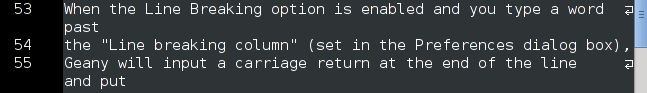

Geany Newsletter #3
-------------------

.. contents::

About Geany
===========

Geany is a small and lightweight Integrated Development Environment.
It was developed to provide a small and fast IDE, which has only a
few dependencies from other packages. Another goal was to be as
independent as possible from a special Desktop Environment like KDE
or GNOME - Geany only requires the GTK2 runtime libraries.

More information about Geany can be found at
`geany.org <http://www.geany.org/>`_.

Geany 0.20.1
============

Geany Development
=================

Bumping dependencies for GTK2 and GLib
^^^^^^^^^^^^^^^^^^^^^^^^^^^^^^^^^^^^^^

Starting with SVN r5839 Geany depends on GTK2 >= 2.12 and GLib >= 2.16 to
make use of some new features introduced with these releases and to avoid
maintaining duplicate code and complicated #ifdef structures.

Plugins
=======

Bumping dependencies for Geany-Plugins project at Geany 0.21 and GTK2 2.12
^^^^^^^^^^^^^^^^^^^^^^^^^^^^^^^^^^^^^^^^^^^^^^^^^^^^^^^^^^^^^^^^^^^^^^^^^^

Starting with SVN 2095 the general section of combined Geany-Plugins
project project is depending on Geany 0.21 and similar to Geany
itself on GTK2 >= 2.12.

New Plugins
^^^^^^^^^^^

Geany Universe
==============

New Geany Wiki
^^^^^^^^^^^^^^

Let us introduce you...
=======================

This section is intended to introduce particular plugins or features
on a regular basis.

Plugin Focus
^^^^^^^^^^^^

Spell Check
***********

Although Geany is primarily an editor aimed at programming tasks,
it's often used to write plain text. Whether you're a native speaker
or not, the spell check plugin is very useful. To check the spelling
of the current document, select Tools > Spell Check > [language]
from the menu to have the spelling checked in that language. If you
often use this feature consider creating a keyboard shortcut to make
activating it easier. If you would prefer to have your spelling
checked immediately, enable the "Check spelling while typing" option
in the plugin's preferences: Edit > Plugin Preferences > Spell Check.

.. image:: ../img/issue3_spellcheck.png

The Spell Check plugin can offer suggestions for misspelled words in
the Message window, in the context menu or both. Choose whichever
option suits you best by checking the options in the plugin's
preferences dialog box.

If you have extra dictionaries in Myspell format you can tell Geany
where these are via the preferences dialog box.

Feature Focus
^^^^^^^^^^^^^

Line Breaking vs Line Wrapping
******************************

In the Document menu are the check boxes Line Breaking and Line
Wrapping. Although their names are similar, they behave differently.

''Line Breaking''

When the Line Breaking option is enabled and you type a word past
the "Line breaking column" (set in the Preferences dialog box),
Geany will input a carriage return at the end of the line and put
the cursor on the line below. This option is best used with plain
text files when you you want to keep every line to a maximum length.
It's not recommended for code since you might not notice the line
break occur and later have to debug the result.

Line Breaking is activated only when you move the cursor past the
"Line breaking column". This means that an already long line will
simply get longer if you add text before the "Line breaking column".
When this happens you can use the "Reflow Lines/Block" function (in
the Edit > Format menu) to adjust all lines so that they're within
the line breaking column. Line Breaking must be enabled per document
via the menu option Document > Line Breaking.

''Line Wrapping''

The Line Wrapping option is similar to Line Breaking but the lines
are only wrapped visually; no carriage returns or line feeds are
added. This option is best used when you want to be able to see the
entire file within the current window. So that it's obvious which
lines have been wrapped, a visual indicator is added to the end of
each wrapped line. Line Wrapping is very CPU-intensive and can slow
down Geany if it's enabled while editing a very large file.

If you prefer to have Line Wrapping enabled by default, there is an
option for this in the Preferences dialog box Editor > Features.
With this option enabled, you can disable Line Wrapping via the menu
option Document > Line Wrapping.

People behind Geany -- Interview
=================================

This is the first in a series of interviews with Geany's contributors:
core developers, plugin developers, translators, wiki maintainers and
any other job we can think of. The purpose of the interviews is to get
to know each of these people a little better: their hopes, dreams,
plans and favourite Geany plugin.

Columban Wendling
^^^^^^^^^^^^^^^^^

Thank you to Colomban Wendling for agreeing to an interview and
congratulations for being the very first. Now on to the questions...

*What motivates you to develop Geany?*

	I use Geany on a daily basis, so I'm concerned about its
	development and improvement. I'm also happy to give back a
	little bit of all the good Geany given me through the years I
	used it :)  And don't be silly: the FAME! :D

*Why do you develop for free instead of devoting this time to paid
projects?*

	Philosophy, naivety... Actually I don't "develop for free" if it
	only means "without being paid", I develop for free "as in
	freedom" software because I like the ideology behind it. Not
	being paid is only a concern in the way I need to do some other
	stuff beside to get money in.

	What I probably prefer in free software is the fact one can
	learn from reading the code. It was a great source of help and
	knowledge when I started learning programming, and it still is.
	A related thing is the ability to modify the software to better
	fit my needs, or simply to fix a bug that concerns me. It serves
	me from time to time (once I discover an annoying bug ^^) and
	allows me to send back the fix to upstream developers, hopefully
	helping other users.

	I won't give all the philosophy behind free software, I think
	you've got my point :)

*Do you do development on other projects that are of interest to you?*

	Not really beside my personal projects. As said above, I send
	patches from time to time to developers of software I use, but
	I'm not really involved in any other project than Geany.

*Do you have a favourite Geany feature and if so, what is it?*

	Most probably the tag completion; but also that almost
	everything is configurable to fit ones needs.

*Do you have a favourite Geany plugin and if so, what is it?*

	If I'd not fear to sound selfish, I'd say GeanyGenDoc :D
	Otherwise, SpellCheck without a doubt.

*What do you do when you're not developing Geany?*

	I continue studying programming, or work on personal projects
	though it's almost the same thing.

*What do you use Geany for?*

	Every one of my programming tasks, and some other text editing.

*Do you use any editors other than Geany? (Of course the answer here
should be "Absolutely not!" but I'm asking it anyway. :)*

	I use Nano for commit messages and administration tasks I need
	to do as root, but for all serious text editing I use Geany.

*In which environments do you use Geany?*

	GNU/Linux (with GNOME), and occasionally Windows (but only when
	I'm forced to use Windows).

About this newsletter
=====================

This newsletter has been created in cooperation by people from
Geany's international community. Contributors to this newsletter and
the infrastructure behind it, ordered by alphabet:

Colomban Wendling,
Enrico Tröger,
Frank Lanitz,
Russell Dickenson
