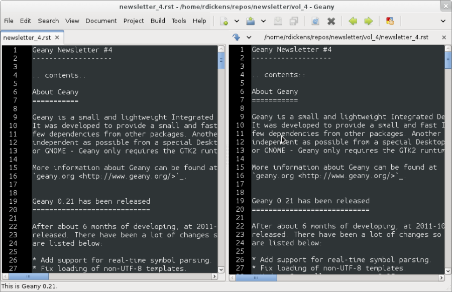

Geany Newsletter #4
-------------------

.. contents::

About Geany
===========

Geany is a small and lightweight Integrated Development Environment.
It was developed to provide a small and fast IDE, which has only a
few dependencies from other packages. Another goal was to be as
independent as possible from a special Desktop Environment like KDE
or GNOME - Geany only requires the GTK2 runtime libraries.

More information about Geany can be found at
`geany.org <http://www.geany.org/>`_.

Geany 0.21 has been released
============================

After about 6 months of development, on 2 October 2011 Geany 0.21 was been
released. There have been a lot of changes, so only the highlights
are listed below:

* Add support for real-time symbol parsing.
* Fix loading of non-UTF-8 templates.
* Update Scintilla to version 2.25.
* Add Scala custom filetype (werg).
* Add Cython custom filetype (Matthew Brush).
* Add support for separate single and multiline comments.
* Add support for filetype-specific indentation settings.
* Add filetype Cobol (Seth Keiper).
* SplitWindow plugin now works on Windows too.
* Add translations: fa.
* Update translations: ca, cs, de, en_GB, es, fi, fr, gl, it, ja, nl,
  pt, pt_BR, sl, sv, tr, vi, zh_CN, zh_TW.

A more complete list can be found on
http://www.geany.org/Documentation/ReleaseNotes

Source tarballs as well as Windows binaries can be found as always on
http://download.geany.org.

Geany-Plugins 0.21 has been released
====================================

On 23 October 2011, about three weeks after Geany 0.21, Geany-Plugins in
its final version has been released. As seen in former newsletters
it has been a quite active time on plugin development, so we are
trying to give you an overview on one hand as well as digging
into some of the bigger changes that have happened.

New Plugins
^^^^^^^^^^^

Most of the new plugins have been already described in one of the
previous editions of this newsletter. However, so only a short overview is
provided here.

* **Debugger**: A plugin to integrate debuggers like GDB. This is replacing
  GeanyGDB in many places.
* **Devhelp**: Integration for GNOME's Devhelp and google code search.
* **GeanyPG**: Encryption, decryption, signing etc. from within Geany via GnuPG.
* **GeanyMacro**: A plugin to record and apply macros.
* **GeanyNumberedBookmarks**: A plugin to store bookmarks to files and
  access them easily via a number.
* **Tableconvert**: A plugin to convert lists into tables.
* **XMLSnippets**: Helps on inserting (common) XML-snippets.

Removed Plugins
^^^^^^^^^^^^^^^
t.b.p.s.

Updates and Bugfixes
^^^^^^^^^^^^^^^^^^^^

General
#######

Significant rework has been done on the Autotools build system as well as some maintenance
work on the Waf-build system.

Addons
######

* DocList addon: Add preference to define the order of the documents
  in the list (#3204573)
* Tasks addon: Activate and update the task list when the Tasks
  addon is enabled

GeanyLaTeX
##########

* Moved LaTeX menu to a separate menu inside Geany main menu
* Added a feature to autocapitalise letters on typing at the beginning of a
  sentence
* Added a way to put an icon for LaTeX wizard into Geany's main
  toolbar
* Added a dialog for inserting BibTeX references based on available \*.bib-files
* Upgrade plugin API to version 199
* Ensure not to insert {} after \^ and \_
* Adding a keystroke to toggle inserting {} after ^ and _
* Fixed an issue with wrong inserted formatting using a keybinding
* Small update to enable i18n also on Geany >= 0.21
* Various bugfixes and memory leak fixes.

GeanySendMail
#############

* Some minor cleaning up of code
* Fix for an issue with replacing of command string when %r was not used
* Don't double free a variable which might end up in a segmentation fault
  when using plugin function more than once.
* Small update to enable i18n also on Geany >= 0.21

Spell Check Plugin
##################

* Reduce artifacts on partially checked words
* Improve \`Check as you type' feature, making it more reliable

Updatechecker
#############

* Fix an issue with init threads for older GTK/glib versions by
  updating to Geany API version 203.
* Small update to enable i18n also on Geany >= 0.21
* Fix a typo inside Waf-build system

WebHelper
#########

* Fix creation of configuration directory in some cases
* Fix missing update of navigation buttons on anchor links
* Fix thread initialization problem
* Fix some issues with keybindings on secondary windows
* Add a keybinding to show/hide web view's window (bug #3156262)
* Allow for better configuration of secondary windows

Internationalisation
####################

* Updated translations: de, pt, ru, tr

Geany-Plugins 0.21.1 has been released
======================================

Shortly after the major release of Geany-Plugins 0.21, an issue with 
the build system was found which blocked installation of source 
tarballs using the Waf-build system. This has been fixed inside a 
minor source release. The Windows binary release isn't affected by 
this issue.

Geany moved to Git
==================

After a long discussion on the mailing list Geany finally moved to Git
as the main version control system. The goal is to be more flexible on
including patchsets from non-core-developers as well as making use
of a number of other features of Git. The new home of the Git
repository is http://github.com where you can access Geany's
sources at https://github.com/geany/geany

During this switch, sources of other Geany-related resources have been
moved to GitHub as well and can be found on the overview page at
https://github.com/geany

Change of project leadership
============================

If you have been using Geany for a while and read the announcement of
Geany 0.21's release, you might have noticed something important.
The leadership of the Geany project has changed from Enrico Tröger to
Colomban Wendling, a current member of the development team.
Enrico's priorities changed so he decided it would be best if
someone else took on the leadership role. During Enrico's time as
leader, Geany has continued to gain in popularity and improve,
whilst staying true to its original design goals.

Thank you, Enrico, for all that you have done, and thanks for taking 
over Colomban.

Geany local
===========

Geany at OpenRheinRuhr 2011
^^^^^^^^^^^^^^^^^^^^^^^^^^^

Together with the guys of Xfce, Geany was presented with another 
booth at the annual OpenRheinRuhr in Oberhausen, Germany -- A 
convention about all topics around Linux, BSD and free software in 
general. The booth was again well visited and people came not only 
to ask for help, but also just for having a little chat with Enrico 
and Frank and discuss about Geany releated topics. 

Let us introduce you...
=======================

This section is intended to introduce particular plugins or features
on a regular basis.

Plugin Focus
^^^^^^^^^^^^

Split Window
############

The Split Window plugin provides a feature which is so useful you'll 
never want to be without it. When enabled, choose Tools > Split 
Window > Side by side | Top and bottom from the main menu and the 
active window is split into two editing panes. Each pane can be 
navigated independently of the other, complete with its own 
scrollbar. 

In each window you can edit separate parts of the same file, with 
each pane updated instantly with the changes made in the other. When 
you want to return to "normal" view, choose Tools > Split Window > 
Unsplit from the main menu. It's not possible to again split the 
active window, only unsplit.

The plugin was intended to allow you to work on the *same* file but 
thanks to a "hidden" feature you can work on two different files 
loaded in the split view. If you open a file while in split window 
mode, it's loaded in the inactive pane. You can then switch between 
the split view of the same file or the different files via the file 
tabs (under the menu bar) as normal. Note that it's not possible to 
change the file shown in the right-hand pane when Split Window is 
active.

Feature Focus
^^^^^^^^^^^^^

Colour Schemes
################

Introduction
++++++++++++

Geany supports colour schemes which allow you to change the colours
applied to various code elements. Two colour schemes are provided with
Geany: Default and Alternate but many more are available (see below). To change
the colour scheme, select from the menu View > Editor > Colour Schemes
> PREFERRED_COLOUR_SCHEME. The colour scheme change is immediate but
the list of available schemes is only loaded when Geany starts.

Adding Colour Schemes
+++++++++++++++++++++

More colour schemes are listed on the Geany Add-ons web page. For
the individual schemes, follow the instructions given by their
authors. One of the biggest set of schemes was created by codebrainz.
The collection is listed on the add-ons page but is hosted at
https://github.com/codebrainz/geany-themes
Follow the installation instructions given on the page, then restart
Geany and all schemes will then be listed in the Colour Schemes menu.

How Colour Schemes Work
+++++++++++++++++++++++

Geany's colour schemes' format has changed over time, so there's a
"legacy" format and the current, preferred format. Schemes in the
different formats can be mixed but the current format is easier to
maintain and modify. In this issue the focus is on the new format
but if readers want it, the legacy format could also be
featured in a future newsletter.

Current colour scheme format
++++++++++++++++++++++++++++

The current colour scheme format works by first defining the colours
to be applied to a file type's elements. This is an extract from a
colour scheme named "Oblivion2"::

    default=0xffffff;0x2e3436;false;false
    tag=0x729fcf;0x2e3436;true;false
    tag_unknown=0xffffff;0x8C0101;true;false

File types and their elements are defined in a file named
filetypes.<FILETYPE>: e.g. filetypes.xml, filetypes.html. All
filetype files are stored in the 'filedef' directory in Geany's
personal data directory. This is an extract from the file type file
for HTML::

    [styling]
    # Edit these in the colorscheme .conf file instead
    html_default=default
    html_tag=tag
    html_tagunknown=tag_unknown

When Geany applies syntax highlighting to a file which matches a filetype,
it matches the element (defined in the filetype's file) with the
matching colour (defined in the colour scheme's file). The advantage of
this scheme over the legacy version is that modifying a colour scheme
for all filetypes requires changes to just one file.

People behind Geany -- Interview
=================================

This is the second in a series of interviews with Geany's
contributors: core developers, plugin developers, translators, wiki
maintainers and any other job we can think of. The purpose of the
interviews is to get to know each of these people a little better:
their hopes, dreams, plans and favourite Geany plugin.

Enrico Tröger
^^^^^^^^^^^^^

As is mentioned above, Enrico Tröger recently stepped down as leader
of the Geany project. In this interview he talks about his history
with the project.

*What motivates you to develop or contribute to FLOSS projects?*

  There are different reasons.
  Most often it is that I want to improve existing software by fixing
  bugs, adding features I'd like to use and so on. So this is a rather
  pragmatic reason.
  Nevertheless, I believe in Free Software and this is another reason
  why I contribute to Free Software. Free Software allows people to
  read and modify the source code to their needs, so in theory everyone
  can make the software or change it to his/her needs. Based on my
  experience, most people push back their changes and so the developers
  can include them if appropriate.
  This is only one of the advantages of Free Software. I doubt this would
  be possible with paid software projects, at least not as long as they
  are not free.

*How did you become Geany's project leader?*

  This was much simpler than you might imagine: I created the project :).

*What is involved in being Geany's project leader?*

  Many different things. It all starts with knowing the project, knowing
  the people involved and ideally knowing the code base :).
  I think the project leader should coordinate the development and
  communicate with the community, making the project a project and not
  just a bunch of lines of code.
  Also, at least in the Geany case in the past, the project leader makes
  the releases though this is not necessarily a project leader task.

  Users, package maintainers and other external people often contact
  the project leader directly via mail or on IRC to say 'thank you',
  ask questions about Geany or to discuss project related topics. So
  this is another task for the project leader.

  And certainly there are many other aspects which I forgot to list.

*What goals did you have when you started as project leader? Did you
achieve those goals?*

  As I didn't explicitly start as project leader but instead just started
  the project, I didn't have any specific goals to achieve as project
  leader however I did have goals to achieve with Geany as project.
  These goals mostly were to create an editor which fits my needs so
  that I can use it to write code and other text documents without
  thinking about the editor, how it behaves, why it is so slow or doesn't
  do what I want. As you see, these were quite personal goals. In the
  meantime, as those goals basically were achieved with Geany 0.1,
  the goals changed to be more general:
  a light and fast editor with basic features of an IDE, without
  unnecessary dependencies to other libraries yet with useful features.
  Oh, and we achieved these goals as well though that doesn't mean Geany
  can't get better anymore. There is always room for improvements and
  new useful features.

*What were some of the highlights of your time as project leader?*

  Hard to name particular highlights.
  One great thing which kept from the beginning to now is to receive mails
  from users who just say 'thank you, Geany is great program'. This is
  always great to read and always increases motivation to continue working
  on Geany (in whatever way). I didn't experience anything like this
  before and would have never expected it. But it's really nice.
  Maybe another highlight worth mentioning is the many things I learned
  during time working on Geany. This includes learning how other people
  use Geany or certain features of Geany, to work with the community
  and to read other people's code and learn from it.

*Are there particular improvements/change/features of which you're proud?*

  The community. Ok, the community is not an improvement, change
  or feature :). But this is what Geany makes Geany. Without the many
  users and contributors, Geany would not be as cool and as stable
  and as feature-rich as it is now.
  Thank you all for using and improving Geany, keep up!

*How does a FLOSS project balance welcoming contributions with keeping within the project's original goals and scope? In other words, avoid scope creep?*

  In Geany's case, luckily there were not much conflicts in accepting
  new features and the overall goal to keep fast and lightweight. However,
  I think a few times we had to deny a feature request for such reasons or
  because it the requested feature didn't fit into Geany.
  This went much better since Nick introduced the plugin interface so that
  features which don't fit into Geany's core, can be easily implemented as
  a plugin.
  Nevertheless, denying a feature request, especially when it was obvious
  that it would actually help the user who requested it but still doesn't
  fit into Geany, was hard for me. It's like
  "I decide that you will not get this functionality". Not a nice job.
  As said, luckily this didn't happen so often.

*Do you have any hopes or dreams for Geany's future?*

  Of course:
  Geany should stay on its road it has been all the time. This is, keeping
  fast and lightweight while offering many useful features to the user.
  Moreover, I really hope and wish, the current fast and intense
  development in the community keeps going so that Geany will evolve
  further and get even better than it is already :).

About this newsletter
=====================

This newsletter has been created in cooperation by people from
Geany's international community. Contributors to this newsletter and
the infrastructure behind it, ordered by alphabet:

* Colomban Wendling 
* Enrico Tröger
* Frank Lanitz
* Lex Trotman
* Russell Dickenson

